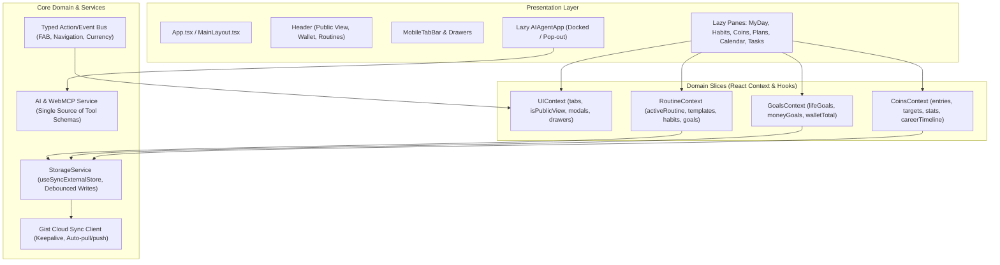

# Whatchadoin Application Refactor Plan & Architectural Blueprint

**Status:** Approved Architectural Specification  
**Target:** Senior / Staff Frontend Engineering  
**Scope:** Performance, Bundle Optimization, Code Splitting, State Management, Cloud Sync, Type Safety, Domain Decomposition, WebMCP Alignment

---

## 1. Executive Summary & Codebase Audit

An exhaustive architectural audit of the `whatchadoin` codebase (`/Users/alhamdulillah/codespace/habits/whatchadoin`) was conducted following recent features introduced on the `coins` branch (including the 1,330+ line `CoinsPane`, 1,440-line `useWebMCPIntegration`, `isPublicView` security mode, and Quick Tasks).

This document establishes the verified source of truth for refactoring the application. It corrects previous misconceptions, accounts for all recent code additions, and lays down a safe, phased implementation roadmap to achieve industry-leading engineering standards without compromising user experience or cloud sync stability.

### The 5 Core Challenges Identified

1. **Massive "God Files" Violating the Single Responsibility Principle (SRP):**
   - [`src/components/HabitsPane.tsx`](file:///Users/alhamdulillah/codespace/habits/whatchadoin/src/components/HabitsPane.tsx) (**2,120 lines**): Combines `@` mention query parsing, Markdown rendering, timelog tracking, habit creation modals, and cascade deletions.
   - [`src/components/MyDay.tsx`](file:///Users/alhamdulillah/codespace/habits/whatchadoin/src/components/MyDay.tsx) (**1,392 lines**): Inlines coordinate math, GCal-style multi-column overlap algorithms, midnight wrap-around scheduling, time inputs, and touch drag polyfills.
   - [`src/hooks/useWebMCPIntegration.ts`](file:///Users/alhamdulillah/codespace/habits/whatchadoin/src/hooks/useWebMCPIntegration.ts) (**1,440 lines**): Implements 22 WebMCP tools, inlining raw tool schemas and re-implementing custom scheduling, collision detection, and template uncoupling logic.
   - [`src/components/CoinsPane.tsx`](file:///Users/alhamdulillah/codespace/habits/whatchadoin/src/components/CoinsPane.tsx) (**1,334 lines**): Inlines career timeline generation, multi-year statistical projections, Recharts visualizations, target management, and CSV/JSON backup/restore.
   - [`src/App.tsx`](file:///Users/alhamdulillah/codespace/habits/whatchadoin/src/App.tsx) (**844 lines**): Centralizes all application state, handles full backup serialization, and coordinates UI panes via massive prop drilling.

2. **Severe Code Duplication (Violating `docs/code_rules.md` Rule 5):**
   - **WebMCP / AI Tools Duplication:** The exact same JSON tool schemas (over 250 lines) are duplicated verbatim between [`src/components/AIAgentApp.tsx` (lines 6–270)](file:///Users/alhamdulillah/codespace/habits/whatchadoin/src/components/AIAgentApp.tsx#L6-L270) and [`src/hooks/useWebMCPIntegration.ts` (lines 58–150)](file:///Users/alhamdulillah/codespace/habits/whatchadoin/src/hooks/useWebMCPIntegration.ts#L58-L150).
   - **Goal Panes Duplication:** [`RoutineGoalPane.tsx`](file:///Users/alhamdulillah/codespace/habits/whatchadoin/src/components/RoutineGoalPane.tsx) (461 lines), [`LifePane.tsx`](file:///Users/alhamdulillah/codespace/habits/whatchadoin/src/components/LifePane.tsx) (414 lines), and [`MoneyPane.tsx`](file:///Users/alhamdulillah/codespace/habits/whatchadoin/src/components/MoneyPane.tsx) (488 lines) share ~80% identical layout, color validation, search/sort bars, and modal management code.

3. **Untyped, Ad-hoc Event Bus with Active Bugs:**
   - Over 15 disparate `window.dispatchEvent(new CustomEvent(...))` calls coordinate state between Floating Action Buttons (FAB), modals, drawers, and tabs.
   - **Active Bug Found:** In [`src/App.tsx` (line 360)](file:///Users/alhamdulillah/codespace/habits/whatchadoin/src/App.tsx#L360), backup import dispatches `whatchadoin_currency_updated`, but [`src/hooks/useCurrency.ts` (line 36)](file:///Users/alhamdulillah/codespace/habits/whatchadoin/src/hooks/useCurrency.ts#L36) listens for `currency-changed`. Restoring backups silently fails to update the active currency in the UI.

4. **Widespread Type Bypass via `// @ts-nocheck`:**
   - Despite `strict: true` in [`tsconfig.app.json`](file:///Users/alhamdulillah/codespace/habits/whatchadoin/tsconfig.app.json), 6 foundational files bypass all type checks:
     - [`src/utils.ts`](file:///Users/alhamdulillah/codespace/habits/whatchadoin/src/utils.ts#L1)
     - [`src/components/HabitsPane.tsx`](file:///Users/alhamdulillah/codespace/habits/whatchadoin/src/components/HabitsPane.tsx#L1)
     - [`src/components/RoutineGoalPane.tsx`](file:///Users/alhamdulillah/codespace/habits/whatchadoin/src/components/RoutineGoalPane.tsx#L1)
     - [`src/components/CalendarPane.tsx`](file:///Users/alhamdulillah/codespace/habits/whatchadoin/src/components/CalendarPane.tsx#L1)
     - [`src/components/MyDayMaker.tsx`](file:///Users/alhamdulillah/codespace/habits/whatchadoin/src/components/MyDayMaker.tsx#L1)
     - [`src/components/BaseModal.tsx`](file:///Users/alhamdulillah/codespace/habits/whatchadoin/src/components/BaseModal.tsx#L1)

5. **Ghost Dependencies & Remaining Synchronous Bundles:**
   - [`@uiw/react-md-editor`](file:///Users/alhamdulillah/codespace/habits/whatchadoin/package.json#L13) is declared in `package.json` but **never imported anywhere**.
   - [`animejs`](file:///Users/alhamdulillah/codespace/habits/whatchadoin/package.json#L14) is imported solely for an initial fade-in in `App.tsx`.
   - While `PlansPane`, `CoinsPane`, and `HabitsPane` are lazy-loaded, `AIAgentApp.tsx` (628 lines), `MyDay.tsx` (1,392 lines), `CalendarPane.tsx` (366 lines), and `TasksPane.tsx` (262 lines) remain statically bundled into `index.js`.

---

## 2. Corrections & Reality Check on the Original Plan

| Previous Plan Assumption | Actual Codebase Reality | Architectural Correction |
| :--- | :--- | :--- |
| **"Zero code splitting in App.tsx"** | `PlansPane`, `CoinsPane`, and `HabitsPane` are **already lazy-loaded** with `React.lazy()` in `App.tsx`. | Keep existing lazy boundaries; add lazy loading for `AIAgentApp`, `CalendarPane`, and `TasksPane`. |
| **"@uiw/react-md-editor is a heavy bundle issue"** | Package is completely unused in the code (ghost dependency). | Purge `@uiw/react-md-editor` from `package.json` immediately. |
| **"sync.ts localStorage override causes main thread typing lag"** | The proxy debounces network sync by 5,000ms. Lag is caused by un-debounced `useEffect` hooks saving massive JSON strings and `sanitizeAllStorage()` parsing all keys on updates. | Do **not** remove Gist sync proxy blindly. Encapsulate persistence in a centralized `StorageService` that debounces disk writes. |
| **"Modernize by replacing useContext with use(AppContext)"** | `useContext` is not deprecated in React 19. A single `AppContext` will cause massive re-render cascades across every component. | Slice state into domain contexts (`UIContext`, `RoutineContext`, `GoalsContext`, `CoinsContext`) and use `useSyncExternalStore` for external storage listeners. |
| **"Migrate index.css to CSS Modules"** | 1,423 lines of CSS rely heavily on compound global selectors across media queries (e.g. `.mobile-tab-myday .left-pane`). CSS Modules will break responsive layouts. | Keep CSS standard; modularize into semantic files (`styles/layout.css`, `styles/timeline.css`, `styles/theme.css`). |
| **Omission of `MyDay.tsx`** | `MyDay.tsx` is 1,392 lines and has identical god-object complexity as `HabitsPane`. | Target `MyDay.tsx` for modular decomposition alongside `HabitsPane` and `CoinsPane`. |
| **Omission of WebMCP & Public View** | 1,440-line `useWebMCPIntegration.ts` and global `isPublicView` mode were unaccounted for. | Fully integrate WebMCP tools and `isPublicView` into the new architecture. |

---

## 3. UI/UX & Architectural Guarantees

Any refactoring must adhere to strict stability and performance guarantees:

1. **Zero Gist Cloud-Sync Regressions:**
   The serverless GitHub Gist synchronization defined in [`docs/context.md`](file:///Users/alhamdulillah/codespace/habits/whatchadoin/docs/context.md) and [`docs/cloud-sync.md`](file:///Users/alhamdulillah/codespace/habits/whatchadoin/docs/cloud-sync.md) must remain completely functional. All keys prefixed with `whatchadoin_` must automatically be synced and sanitized on startup and unload.
2. **Identical Visual Physics & Animations:**
   The `animejs` entrance animation must be replaced with native CSS keyframes that replicate the exact `easeOutExpo` curve and staggered delays.
3. **Public View Mode Integrity:**
   `isPublicView` must seamlessly mask confidential numbers in `CoinsPane`, filter non-public goals in `HabitsPane`, `RoutineGoalPane`, `LifePane`, `MoneyPane`, and `TasksPane`, and adjust header wallet totals.
4. **Touch & Drag-and-Drop Fidelity:**
   The `mobile-drag-drop` polyfill integration, touch action locks (`touch-action: none` / `pan-y`), 15-minute grid snapping, and drag handles (`GripVertical`) must remain identical.
5. **Zero Cumulative Layout Shift (CLS):**
   All `React.lazy()` boundaries must use matched skeleton suspense fallbacks.

---

## 4. Target Architecture



### A. State Slicing Architecture
To prevent re-rendering the entire DOM when a habit is checked or a timer ticks, state is partitioned into 4 domain slices:

1. **`UIContext`**:
   - Manages: `activeCenterTab`, `activeLeftTab`, `mobileTab`, `isPublicView`, `aiDockState`, `isRoutineDrawerOpen`, `isWalletModalOpen`, `confirmConfig`.
   - High render frequency for tab navigation, zero impact on data models.
2. **`RoutineContext`**:
   - Manages: `routines`, `activeRoutineId`, `activeRoutine`, `templates`, `habits`, `routineGoals`, `dayMapping`, `dailyLogs`, `timeLogs`.
   - Exposes memoized action dispatchers (`updateActiveRoutine`, `addHabit`, `deleteBlock`, `scheduleBlock`).
3. **`GoalsContext`**:
   - Manages: `lifeGoals`, `moneyGoals`, computed `allWalletGoals`, and `headerWalletTotal`.
4. **`CoinsContext`**:
   - Manages: `coinsEntries`, `coinsTargets`, computed `coinsStats`, `careerTimeline`, and currency formatting via `useCurrency`.

### B. Reactive Storage Layer (`src/services/storage.ts`)
- Implements `useSyncExternalStore` for clean, tearing-free synchronization with browser storage.
- Replaces raw `localStorage.setItem` calls with a debounced write pipeline (300ms debounce for typing in editors/forms; immediate write for button clicks/deletions).
- Centralizes data sanitization without repeatedly executing `sanitizeAllStorage()` on every keystroke.
- Integrates transparently with `sync.ts` for Gist Cloud Sync.

### C. Unified WebMCP & AI Architecture (`src/features/ai/`)
- Define tool specifications in a single shared file: `src/features/ai/tools.ts`.
- Both `useWebMCPIntegration.ts` (for browser WebMCP clients) and `AIAgentApp.tsx` (for the internal assistant) import the same tool definitions.
- Tool executions invoke pure domain functions rather than duplicating scheduling and collision logic.

---

## 5. Phased Implementation Roadmap

### Phase 1: Dead Dependency Purge, Quick Wins & Linting (Low Risk)
1. **Remove Unused Dependencies:**
   - Uninstall `@uiw/react-md-editor` from `package.json`.
   - Remove `animejs` and `@types/animejs` from `package.json`.
2. **Native CSS Entrance Animation:**
   - In [`src/index.css`](file:///Users/alhamdulillah/codespace/habits/whatchadoin/src/index.css), define `@keyframes appEntrance`:
     ```css
     @keyframes appEntrance {
       from { opacity: 0; transform: translateY(24px); }
       to { opacity: 1; transform: translateY(0); }
     }
     .pane { animation: appEntrance 0.7s cubic-bezier(0.16, 1, 0.3, 1) both; }
     ```
   - Delete `animejs` imports and `useEffect` in [`src/App.tsx` (lines 442–459)](file:///Users/alhamdulillah/codespace/habits/whatchadoin/src/App.tsx#L442-L459).
3. **Lazy-Load Remaining Heavy Panes:**
   - Convert `AIAgentApp`, `CalendarPane`, and `TasksPane` to `React.lazy()` in `App.tsx`.
4. **Fix Discovered Currency Sync Bug:**
   - Align event naming: standardize on `whatchadoin_currency_updated` in both [`src/App.tsx`](file:///Users/alhamdulillah/codespace/habits/whatchadoin/src/App.tsx#L360) and [`src/hooks/useCurrency.ts`](file:///Users/alhamdulillah/codespace/habits/whatchadoin/src/hooks/useCurrency.ts#L36).
5. **Fix Code Rules Violations:**
   - Fix Rule 1 in [`src/utils.ts` (lines 398–405)](file:///Users/alhamdulillah/codespace/habits/whatchadoin/src/utils.ts#L398-L405): replace `throw new Error` with boolean return.
   - Fix all 16 `oxlint` warnings (unused parameters in `RoutineGoalPane.tsx`, unused catch variables in `CoinsPane.tsx` and `MyDay.tsx`, missing hook dependencies).

---

### Phase 2: Domain Types & Strict Type Safety (Zero Runtime Risk)
1. **Create Dedicated Type Definitions (`src/types/`):**
   - `routine.ts`: `Routine`, `Template`, `TemplateBlock`, `Habit`, `RoutineGoal`, `DayMapping`.
   - `goals.ts`: `LifeGoal`, `MoneyGoal`, `WalletItem`.
   - `coins.ts`: `CoinsEntry`, `CoinsTarget`, `CoinsStats`, `CoinsDraft`.
   - `ui.ts`: `CenterTab`, `LeftTab`, `MobileTab`, `ConfirmConfig`, `AIDockState`.
2. **Remove `// @ts-nocheck` Directives:**
   - Fix types in [`src/utils.ts`](file:///Users/alhamdulillah/codespace/habits/whatchadoin/src/utils.ts).
   - Fix types in [`src/components/BaseModal.tsx`](file:///Users/alhamdulillah/codespace/habits/whatchadoin/src/components/BaseModal.tsx) and [`src/components/MyDayMaker.tsx`](file:///Users/alhamdulillah/codespace/habits/whatchadoin/src/components/MyDayMaker.tsx).
   - Fix types in [`src/components/RoutineGoalPane.tsx`](file:///Users/alhamdulillah/codespace/habits/whatchadoin/src/components/RoutineGoalPane.tsx) and [`src/components/CalendarPane.tsx`](file:///Users/alhamdulillah/codespace/habits/whatchadoin/src/components/CalendarPane.tsx).
   - Fix types in [`src/components/HabitsPane.tsx`](file:///Users/alhamdulillah/codespace/habits/whatchadoin/src/components/HabitsPane.tsx).
3. **Verify Build:**
   - Ensure `npm run build` (`tsc -b && vite build`) passes with zero errors and zero `@ts-nocheck` directives.

---

### Phase 3: Centralized Reactive Storage & Safe Cloud Sync (Medium Risk)
1. **Implement `src/services/storage.ts`:**
   - Create a typed `StorageService` wrapping `localStorage` with:
     - Debounced write queue for high-frequency text mutations.
     - Event notification mechanism for same-window updates (`useSyncExternalStore`).
     - Auto-sanitization hooks.
2. **Preserve Transparent Gist Sync:**
   - Retain interception of `whatchadoin_*` storage keys in [`src/sync.ts`](file:///Users/alhamdulillah/codespace/habits/whatchadoin/src/sync.ts).
   - Guarantee that Gist export/import continues to back up all routines, plans, life goals, money goals, tasks, and coins entries.
3. **Formalize Event Bus (`src/utils/events.ts`):**
   - Type all FAB actions (`fab:add-habits`, `fab:add-myday`, `fab:add-task`, etc.) and system events.

---

### Phase 4: Domain Sliced Contexts & Prop Drilling Eradication (Medium Risk)
1. **Create Context Providers:**
   - `src/context/UIContext.tsx`
   - `src/context/RoutineContext.tsx`
   - `src/context/GoalsContext.tsx`
   - `src/context/CoinsContext.tsx`
2. **Refactor `App.tsx`:**
   - Wrap the application tree with the providers.
   - Remove 10–20 drilled props from `HabitsPane`, `MyDay`, `RoutineGoalPane`, `MoneyPane`, `LifePane`, and `Header`.
3. **Extract `MainLayout.tsx`:**
   - Keep `App.tsx` clean (providers, root shell, modals).
   - Move layout shell, desktop flexbox, and mobile drawer transitions into `MainLayout.tsx`.

---

### Phase 5: Modular Decomposition of the 4 God Files (High Value)

#### 1. Decompose `src/components/MyDay.tsx` (1,392 lines) $\rightarrow$ `src/features/timeline/`
- `timelineMath.ts`: Pure mathematical calculations (minute-to-pixel scaling, coordinate drops, GCal multi-column overlap packing, midnight wrap-around).
- `timeUtils.ts`: Pure string parsing (`parseTime`, `formatTime`, military time conversion).
- `TimelineGrid.tsx`: 24-hour hour lines, background grid, current-time indicator line.
- `TimelineBlock.tsx`: Render individual scheduled block with resize handles, delete button, and duration pill.
- `BlockTimeEditor.tsx`: Extracted from inline `BlockTimeInputs`.
- `TemplateSelector.tsx`: Day mapping, template switching, and template management dropdowns.

#### 2. Decompose `src/components/HabitsPane.tsx` (2,120 lines) $\rightarrow$ `src/features/habits/`
- `HabitCard.tsx`: Individual habit item, drag-and-drop triggers, Markdown preview, timelog status pill.
- `HabitModal.tsx`: Extracted habit creation/edit modal with duration picker and goal linkages.
- `MentionDropdown.tsx`: Extracted `@` mention menu with coordinate positioning.
- `TimelogView.tsx`: Daily completion tracking and calendar date milestone block.

#### 3. Decompose `src/components/CoinsPane.tsx` (1,334 lines) $\rightarrow$ `src/features/coins/`
- `coinsMath.ts`: Statistics computations (`buildFullTimeline`, career averages, YoY growth, streak calculations).
- `CoinsCharts.tsx`: Memoized Recharts wrappers (Area, Composed, Bar, Pie charts).
- `CoinsEntryModal.tsx` & `CoinsRangeModal.tsx`: Single-month and multi-month batch entry dialogs.
- `CoinsStatsGrid.tsx`: Career metrics, highest earning month, and target cards.

#### 4. Decompose `useWebMCPIntegration.ts` (1,440 lines) & `AIAgentApp.tsx` (628 lines) $\rightarrow$ `src/features/ai/`
- `toolDefinitions.ts`: Single source of truth for all 22 WebMCP/AI JSON tool schemas.
- `toolExecutors.ts`: Central execution dispatcher calling shared domain functions (`addGoal`, `scheduleBlock`, `moveBlock`) rather than duplicating scheduling logic.
- `useWebMCPIntegration.ts`: Light adapter (under 200 lines) registering tools to WebMCP.

---

### Phase 6: Goal Panes Unification & DRY Polish (Low Risk)
1. **Unify Goal Panes:**
   - Extract a generic `<GoalListPane />` component to power `RoutineGoalPane`, `LifePane`, and `MoneyPane`, eliminating over 700 lines of duplicated search, sort, color selection, and card rendering logic.
2. **Vite Optimization:**
   - Clean up `rollupOptions.output.manualChunks` in [`vite.config.ts`](file:///Users/alhamdulillah/codespace/habits/whatchadoin/vite.config.ts) to let Vite dynamically optimize route and lazy-component chunks.

---

## 6. Verification & Quality Gates

Each phase must satisfy the following verification criteria prior to merge:

1. **Type Checker:** `npx tsc -b` must pass with **0 errors** under `strict: true`.
2. **Linter:** `npm run lint` (`oxlint`) must complete with **0 warnings and 0 errors**.
3. **Bundle Benchmark:**
   - Measure `dist/` bundle sizes before and after Phase 1 and Phase 5.
   - Initial entry `index-*.js` chunk must decrease from 194 kB to **under 100 kB**.
4. **Cloud Sync Roundtrip Test:**
   - Validate bidirectional Gist sync: verify that changes made on one client sync to Gist and rehydrate properly without losing keys or leaking tokens.
5. **UI & Regression Checklist:**
   - Verify timeline drag-and-drop physics on desktop and touch devices.
   - Verify `isPublicView` masking across all tabs and header totals.
   - Verify all 22 WebMCP tools execute properly through the AI Assistant.
   - Test backup export and import cycle with currency preservation.
